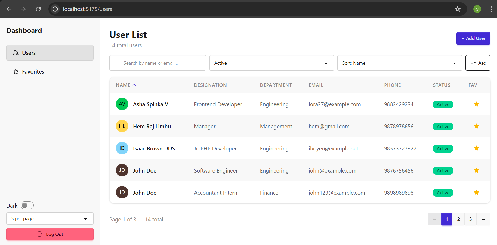
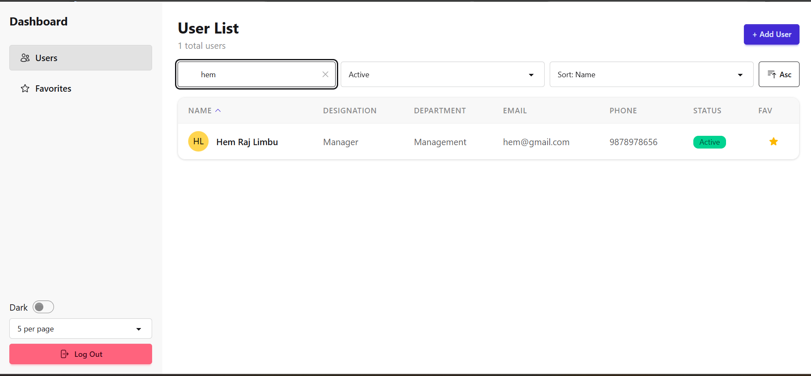
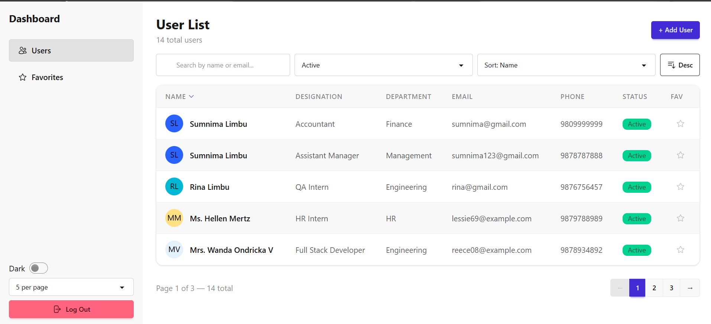
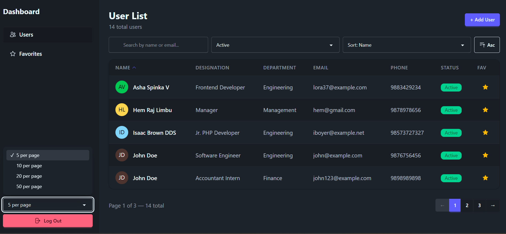
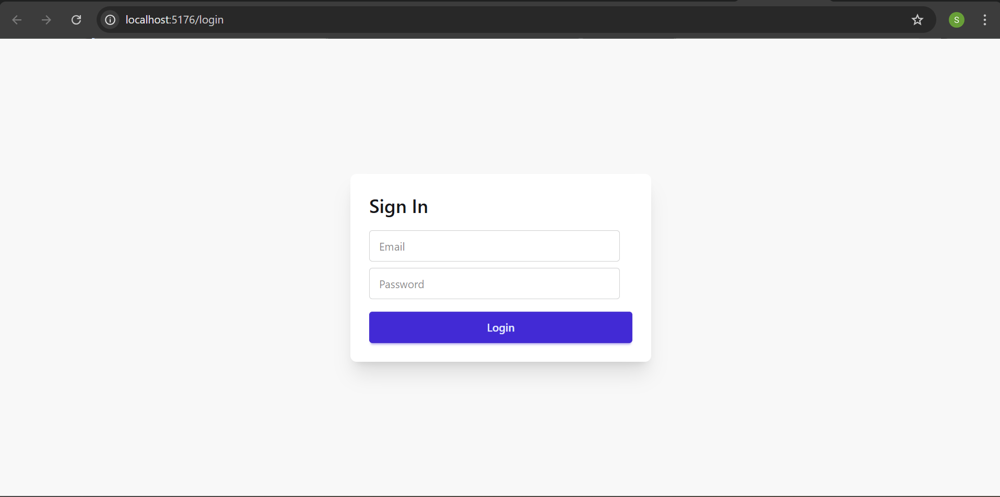
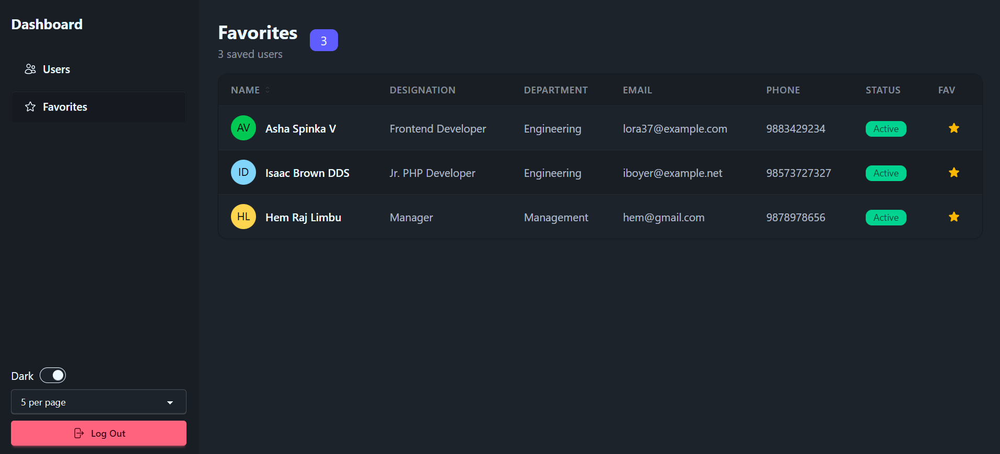

# User Management App

A responsive single-page application built as a React programming challenge. It provides user listing, detail views, favorites management, and authentication all backed by a Laravel REST API.

---

## Features

- **Authentication** — Login, protected routes, persistent session via localStorage
- **User List** — Paginated table with search, sort, and status filter
- **User Detail** — Full profile view with avatar, designation, department, contact info, and status
- **Favorites** — Star/unstar users, persisted locally, bulk-fetched from API
- **Theme Toggle** — Light / Dark mode via DaisyUI, persisted across sessions
- **Responsive Layout** — Collapsible sidebar drawer on mobile, static sidebar on desktop
- **Cache Layer** — Previously fetched users are cached in context to reduce API calls

---

## Tech Stack

| Layer | Technology |
|-------|-----------|
| Framework | React 19 |
| Routing | React Router DOM v7 |
| Styling | Tailwind CSS v4 + DaisyUI v5 |
| Icons | Heroicons v2 |
| HTTP Client | Axios |
| Build Tool | Vite |
| Backend | Laravel (REST API) |

---

## Project Structure

```
src/
├── api/
│   └── userApi.js          # Axios instance + API calls
├── context/
│   └── AppContext.jsx       # Global state 
├── layouts/
│   └── DashboardLayout.jsx  # Sidebar + responsive 
├── pages/
│   ├── LoginPage.jsx
│   ├── UserListPage.jsx
│   ├── UserDetailPage.jsx
│   └── FavoritesPage.jsx
├── components/
│   ├── Pagination.jsx
|   ├── UserTable.jsx        
│   └── SearchFilter.jsx     
└── main.jsx                 # App entry, routes, ProtectedRoute
```

---

## Getting Started

### Prerequisites

- Node.js >= 18
- A running Laravel backend (see [Backend Setup](#backend-setup))

### Installation

```bash
git clone <your-repo-url>
cd user-management-app

npm install

cp .env.example .env

npm run dev
```

---


## Backend Setup

The app expects a Laravel backend with the following API routes:

```
POST   /api/login
GET    /api/v1/users              # Paginated user list
GET    /api/v1/users/favorites    # Favourited users   
GET    /api/v1/users/{user}       # Single user detail
```

---

## Screenshots


fig:Dashboard


fig:Filtering


fig:Sorting in descending order by name


fig:Dark Theme


fig:Login Page


fig:Favorite Page


---

## License

This project was built as a programming challenge. Feel free to use it as a reference or starting point.